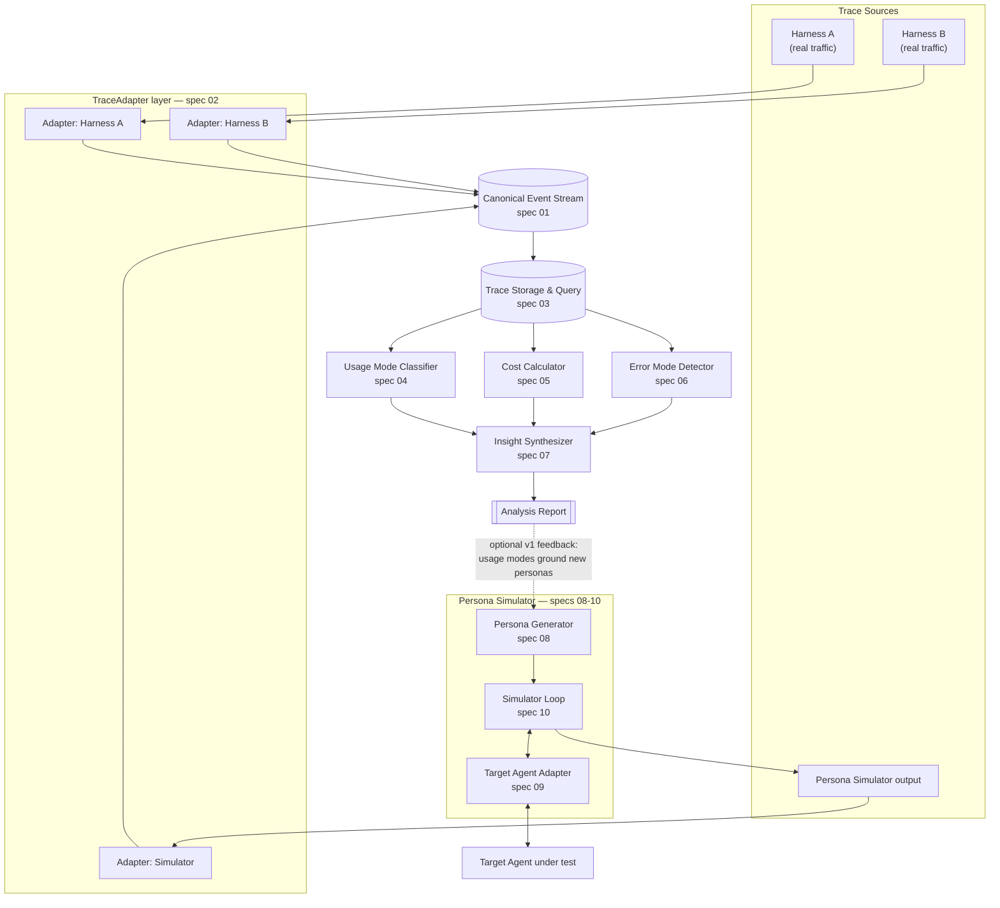

# System Design: Trace Analytics & Persona-Based Usage Simulator

This is the 10,000-foot view. For the product-facing problem/solution/user stories, see [`.scratch/trace-analytics-persona-simulator/spec.md`](.scratch/trace-analytics-persona-simulator/spec.md). For per-component build details, open-source research, and experiment designs, see [`engineering-specs/`](engineering-specs/). This document exists to answer the questions that span all of them: what the system looks like end to end, and what it costs in latency, failure modes, and risk to build it this way.

## 1. Goals

- Turn a corpus of agent conversation traces — from any source, present or future — into usage-mode, cost, and error-mode analytics, plus synthesized product insights.
- Generate a wide, use-case-grounded variety of simulated personas and drive them against a target agent to produce trace volume for chaos/stress/scale testing ahead of or alongside real traffic.
- Do both through one shared, source-agnostic trace representation, so the same analytics pipeline serves real and synthetic data identically.
- Default to adopting open-source implementations over custom code at every component, reserving custom work for the interface/glue layer that connects them.

## 2. Non-Goals (Scope Boundaries)

- No dashboard/UI. Output is structured report data + narrative text; visualization is a separate, later effort.
- No real-time/streaming analysis. v0 is batch: traces are exported, then analyzed.
- No automatic remediation. The system surfaces error modes; it does not act on them.
- No general-purpose multi-agent orchestration platform. The simulator drives one target agent per run through a narrow adapter interface — it is not a framework for building agents.
- Not building every possible `TraceAdapter` up front — just enough (two, per spec 02) to prove the seam holds.

## 3. High-Level Architecture

Two loops, one seam between them: the analytics pipeline (top) is entirely source-agnostic — it never knows or cares whether an `Event` originated from real traffic or the simulator. The optional dotted feedback edge (report → persona generator) is explicitly v1, not required for v0 to function (see spec 08).

## 4. Data Model

The canonical unit is the `Event` (full detail in spec 01):

- Required envelope: `sequence`, `actor` (`user`/`agent`/`tool`), `timestamp`, `kind` (`message`/`tool_call`/`tool_result`/`handoff`/`error`).
- Open `attributes` map for everything else (tokens, model, tool args), using `gen_ai.*`-style keys borrowed from the OpenTelemetry GenAI semantic conventions vocabulary without adopting OTel's span-tree infrastructure.
- `model`/`harness`/`version` are best-effort attributes, never guaranteed fields — the whole system is built around traces *not* having a fixed shape across sources.

## 5. API / Interface Surface

Each component exposes exactly one call; nothing downstream reaches past it into another component's internals (deep-module discipline, applied consistently):

| Component | Interface |
|---|---|
| `TraceAdapter` (spec 02) | `normalize(raw_export) -> list[Event]` |
| Storage (spec 03) | `write(events)` / `query(spec) -> rows` |
| Usage Mode Classifier (spec 04) | `classify(traces) -> UsageModes` |
| Cost Calculator (spec 05) | `compute_cost(trace) -> CostResult` |
| Error Mode Detector (spec 06) | `detect(trace) -> list[ErrorMode]` |
| Insight Synthesizer (spec 07) | `synthesize(usage_modes, cost, error_modes) -> AnalysisReport` |
| Persona Generator (spec 08) | `generate(target_agent_description, count) -> list[PersonaSpec]` |
| Target Agent Adapter (spec 09) | `send(conversation_so_far) -> agent_response` |
| Simulator Loop (spec 10) | `simulate(persona_spec, agent_adapter, scenario) -> native_transcript` |

## 6. Capacity Estimation (Back-of-Envelope)

No real traffic numbers exist yet — this repo is greenfield (see engineering-specs). The figures below are placeholders to be replaced once an integration target (spec 02) is chosen; they exist to make the *shape* of the estimate explicit, not to assert a real number:

- **Assume** 10K real traces/day once integrated, plus simulator runs at 10-100x that for stress testing (100K-1M synthetic traces/day in a chaos-test run).
- At ~20 events/trace average, 1M traces/day ≈ 20M events/day ≈ ~230 events/sec sustained, well within DuckDB's single-node throughput (spec 03's candidate).
- Storage growth: at ~2KB/event (message text + attributes), 20M events/day ≈ ~40GB/day raw before compression — this is the number that should drive the spec-03 experiment's largest benchmark tier (the spec already tests up to 1M events; revisit that ceiling once this estimate is replaced with a real one).
- Simulator concurrency: chaos-testing "at scale" implies N simulated conversations in parallel, each holding its own target-agent connection — this is the concurrency axis spec 10's experiment measures per candidate framework, not an afterthought.

## 7. Latency Budget

Two very different latency regimes exist in this system and must not be conflated:

- **Analytics pipeline (specs 03-07): batch, offline.** No user is waiting synchronously on an `AnalysisReport`. The relevant latency metric is throughput per run (spec 03's and spec 04's experiments both measure this explicitly), not p99 response time.
- **Simulator loop (specs 08-10): interactive, per-turn.** Each simulated conversation turn round-trips through `agentAdapter` to a real target agent and back; this is where user-perceptible-style latency actually matters, since it gates how much simulated volume can be generated per unit time. Spec 10's experiment treats concurrency support as a first-class metric for exactly this reason — the loop's own overhead (not the target agent's response time, which this system doesn't control) is what must stay low.
- The usage-mode classifier (spec 04) was corrected mid-review specifically because its original design didn't treat latency as a gating constraint; see spec 04 for the revised, speed-first experiment.

## 8. Reliability & Fault Tolerance

- A malformed or partial trace from any adapter degrades to `unknown` fields (spec 01), never an exception that halts a batch run — one bad trace must not fail an entire analysis run.
- An `agentAdapter` failure mid-simulation (spec 09/10) is a first-class outcome the simulator loop must record on the transcript (as an `error`-kind `Event` once normalized), not a silent drop — a target agent crashing under simulated load is itself a signal this system exists to surface.
- Adopted external dependencies (LiteLLM's pricing table, TRAIL's labels, PersonaHub's dataset) are pinned/versioned where the underlying spec says so (e.g. spec 05's pricing table is explicitly a swappable dependency), so an upstream update can't silently change this system's output between runs.

## 9. Security & Privacy

- **Trace content may contain sensitive or personally identifiable user data.** This system's core function is storing and analyzing full conversation content at volume — storage (spec 03), the LLM-judge calls in error-mode detection (spec 06), and the narrative synthesis step (spec 07) all see raw trace text. Access to stored traces and generated reports should be scoped to whoever operates this system, not broadly shared by default.
- **Adopted public datasets carry their own data-handling terms.** LMSYS-Chat-1M and WildChat are real user conversations released under specific research/redistribution terms; TRAIL and PersonaHub likewise. Using them as fixtures (per each spec's Test Datasets section) means respecting those terms, not just treating them as generic files.
- **`agentAdapter` (spec 09) holds credentials** for whichever target agent/provider it's configured against (API keys via LiteLLM, or harness-specific auth for a CLI-driven target). These are secrets, not configuration — standard secret-management practice applies, out of scope to re-specify here.
- No user-facing authentication/authorization system is in scope for v0 (no dashboard exists to gate, per Non-Goals) — this is a single-operator system at this stage, not a multi-tenant product.

## 10. Cost (of Running This System)

Distinct from spec 05's cost *analytics* (which measures the target agent's serving cost) — this is what operating the analytics/simulator system itself costs:

- LLM calls: usage-mode cluster labeling (spec 04, once per cluster, not per trace), error-mode LLM-judge calls (spec 06, potentially per trace — the dominant cost driver if run at full corpus volume every time), narrative synthesis (spec 07, once per report), and persona generation (spec 08, once per persona, not per turn).
- Compute: the embedding/clustering step (spec 04) is now optimized to run on commodity CPU via Model2Vec, with GPU as an optional accelerant — not a required cost line.
- Storage: governed by the capacity estimate in §6 and whichever engine spec 03's experiment selects; DuckDB's embedded, serverless model has no standing infrastructure cost, unlike a hosted database or a full observability platform.
- The simulator's own LLM-call cost (persona-driven conversations against a target agent) scales directly with how much synthetic volume a chaos-test run generates — this is a dial the operator controls per run, not a fixed baseline cost.

## 11. Trade-offs & Alternatives Considered

Recap of the significant either/or calls made across the engineering specs, since a system-design review should make trade-offs visible in one place rather than buried per-component:

| Decision | Chosen | Alternative(s) rejected | Why |
|---|---|---|---|
| Trace vocabulary | OTel GenAI attribute naming, not OTel infrastructure | Full OTel Collector/span-tree adoption | Avoids importing distributed-tracing infra this project doesn't need; vocabulary is still pre-1.0 and shifting, so infra lock-in would be premature (spec 01) |
| Storage engine | Embedded analytical engine (DuckDB-class), pending benchmark | Full observability platform (Langfuse/Phoenix) as storage | Platforms bring an ingestion model and UI this project doesn't need yet and would bend the adapter architecture to fit theirs (spec 03) |
| Usage clustering | BERTopic-shaped pipeline with Model2Vec embeddings (speed-first) | Same pipeline with full transformer embeddings (quality-first, but slower); pure LLM classification | Speed is a gate, not a tiebreaker, per explicit priority; original design under-weighted latency (spec 04) |
| Error-mode ground truth | Adopt TRAIL (existing labeled dataset) | Hand-label a fixture set from scratch | An existing, larger, rigorously-labeled dataset beats a smaller one built as a spec side-effect (spec 06) |
| Persona diversity | PersonaHub-seeded + use-case grounding (hybrid) | Pure LLM grounding only; PersonaHub without grounding | Experiment-gated: pure grounding risks mode collapse, pure PersonaHub isn't relevant to the target agent (spec 08) |
| Simulator loop | τ-bench-style harness, pending integration-effort benchmark | General orchestration frameworks (LangGraph/CrewAI/AutoGen) | Purpose-built for simulated-user-vs-agent, not repurposed from a different job (spec 10) |

## 12. Monitoring & Observability (of This System Itself)

A system whose product is observability needs its own, separate from what it produces for the target agent:

- Per-adapter failure/malformed-trace rate (spec 02) — a spike here means a source's export format changed upstream.
- Per-component latency and cost against the budgets in §7/§10 — regressions here are exactly what spec 04's "standing regression check" on the classifier's latency gate is meant to catch, generalized to every component.
- `agentAdapter` error rate during simulation runs (spec 09/10) — distinguishing "the target agent is genuinely struggling" (a finding) from "our own adapter is broken" (a bug) matters and must not be conflated.

## 13. Rollout Plan

Follows the dependency graph in [`engineering-specs/README.md`](engineering-specs/README.md) directly — it *is* the rollout plan:

1. **Foundation** (spec 01): canonical schema. Nothing else can start meaningfully before this.
2. **Prove the seam** (spec 02): two adapters, one real source + the simulator's own — the point where "not a fixed format" gets tested for real, not just asserted.
3. **Make data queryable** (spec 03): storage/query layer.
4. **Analytics components in parallel** (specs 04, 05, 06): each only depends on 01+03, so these can build concurrently once the foundation lands.
5. **Synthesize** (spec 07): depends on all three analytics components.
6. **Simulator components in parallel** (specs 08, 09): each only depends on 01, buildable alongside the analytics track.
7. **Close the loop** (spec 10): depends on 02, 08, 09 — the last piece, since it's where persona generation, the target-agent adapter, and the simulator's own trace adapter all meet.

## 14. Open Questions & Risks

- Which real harness/agent gets the first `TraceAdapter` (spec 02) is still undecided — it gates the entire real-data half of the rollout and should be resolved before ticket-cutting starts.
- Model2Vec's semantic quality on this project's specific request text (as opposed to the general benchmarks cited in spec 04) is unverified until the experiment actually runs — the speed win is well-evidenced generically, the quality trade-off on *this* data is not yet.
- τ-bench's task/API-tool domain assumptions may not transfer cleanly to an arbitrary target agent outside retail/airline-style domains — spec 10's experiment is designed to surface this rather than assume it away.
- No production-scale numbers exist yet (§6 is explicitly placeholder) — every capacity/latency conclusion here should be revisited once real traffic (or a serious chaos-test run) produces actual numbers.
